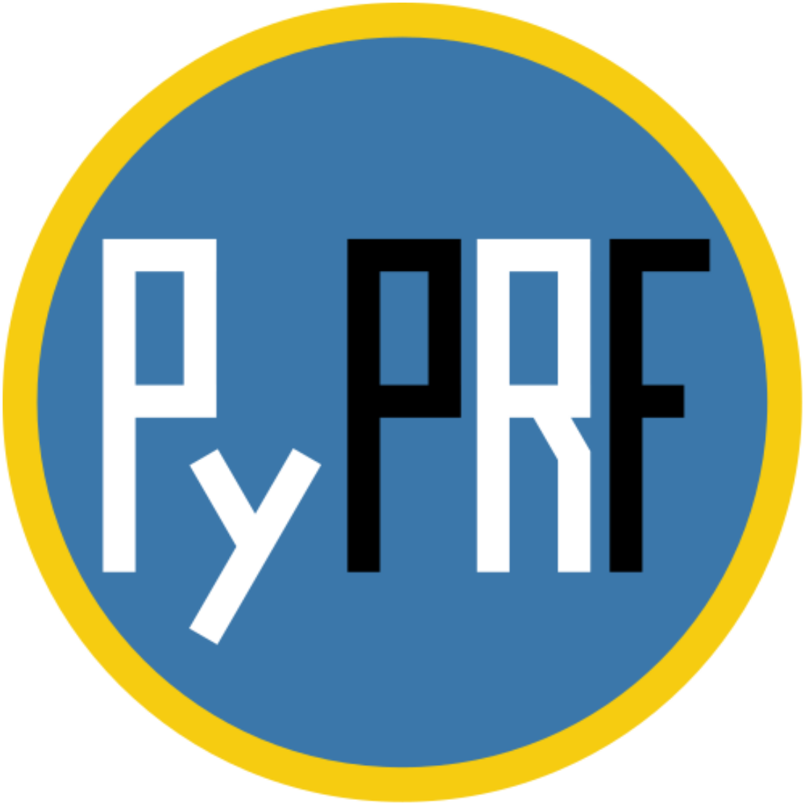

[](https://doi.org/10.5281/zenodo.835162)
[](https://travis-ci.org/ingo-m/pyprf)
[](https://codecov.io/gh/ingo-m/pyprf)

# PyPRF


A free & open source *python package* for *population receptive field (PRF) analysis*. This package is mainly developed for functional magnetic resonance imaging (fMRI) experiments. There are two main parts:

### 1. Stimulus presentation
Presents visual stimuli for retinotopic mapping experiments. The stimuli consist of bars at different locations and orientations, filled with flickering black and white checkerboards. It is important that the participant fixates throughout the experiment. Therefore, there is a central fixation task. The fixation dot occasionally changes its colour, and the task is to press a button (number `1`) in response. At the end of the presentation, the participant's hit rate is provided as feedback.

### 2. Data analysis  
Analysis tools for fMRI data from retinotopic mapping experiment. A pRF is estimated for each voxel (see [1]). The pRF model used here is a 2D Gaussian; the free parameters are the Gaussian's x- and y-position, and its width (SD). This rather simple pRF model is best suited for early visual cortex (higher cortical areas may require more complex models).

## How to use

1. The stimulus presentation is implemented in [Psychopy](http://psychopy.org/), so if you would like to run the experiment, you first need to install it (if you just want to run the analysis, you can skip this step). On [debian](https://www.debian.org/), Psychopy can easily be installed using `apt-get`:

```bash
sudo apt-get install psychopy
```

If you're running some other operating system, please refer to the [Psychopy website](http://psychopy.org/).

2. Install `numpy`. For instance:

```bash
pip install numpy
```
 (Or, alternatively, if you're using conda, `conda install -c conda-forge numpy`.)

3. The `pyprf` package can directly be installed from PyPI, in the following way:

```bash
pip install pyprf
```

(Alternatively, you could also installed it from the repository, like this: `git clone https://github.com/ingo-m/pyprf.git` followed by `pip install /path/to/pyprf`.)

4. Stimulus presentation:

You can call the presentation script from command line:

``` bash
python ~/pyprf/pyprf/stimulus_presentation/Main/prfStim_Bars.py
```

Alternatively, you could start the Psychopy GUI and run the script form there (see [Psychopy documentation](http://www.Psychopy.org/documentation.html) for futher details). After starting the script you can enter *Participant ID* and *run number* in the general user interface (GUI). By default, the folder ```~/pyprf/pyprf/stimulus_presentation/Conditions/``` contains pseudo-randomised design matrices for 3 runs. In order to use these, enter '01', '02', or '03' in the respective field in the GUI. *If you would like to simply run the presentation one time, you can leave this setting at its default value ('01').*

After starting the script, it will wait for a trigger signal from the fMRI scanner (default: keyboard button number ```5```).

You can interrupt the presentation by pressing ```ESC```.

5. Data analysis:

In order to prepare the analysis, you need to run the stimulus presentation script in *logging mode* in order to create a log of the stimulus presentation. Open ```~/pyprf/pyprf/stimulus_presentation/Main/prfStim_Bars.py``` in a text editor and set ```lgcLogMde = True```.

Now run the script either from command line or through the Psychoy GUI.

The stimulus presentation log is created in the folder ```~/pyprf/pyprf/stimulus_presentation/Log_<participant_ID>/pRF_mapping_log/Frames/```.

The analysis parameters are set in a config file. An example file can be found at `~/pyprf/pyprf/analysis/config_default.csv`. See comments therein for more information.

Run the analysis:
``` bash
pyprf -config /path/to/config.csv
```

## Dependencies
[**Python 2.7**](https://www.python.org/download/releases/2.7/)

If you install `pyprf` using `pip` (as described above), all of the following dependencies except for `Psychopy` and `numpy` are installed automatically - you do not have to take care of this yourself. Simply follow the above installation instructions.

| Stimulus presentation                                 | Tested version |
|-------------------------------------------------------|----------------|
| [Psychopy](http://www.Psychopy.org/)                  | 1.83.04        |
| [NumPy](http://www.numpy.org/)                        | 1.14.0         |
| [SciPy](http://www.scipy.org/)                        | 1.0.0          |
| [Pillow](https://pypi.python.org/pypi/Pillow/4.3.0)   | 5.0.0          |

| Data analysis                                         | Tested version |
|-------------------------------------------------------|----------------|
| [NumPy](http://www.numpy.org/)                        | 1.14.0         |
| [SciPy](http://www.scipy.org/)                        | 1.0.0          |
| [NiBabel](http://nipy.org/nibabel/)                   | 2.2.1          |
| [Cython](http://cython.org/)¹                         | 0.27.1         |
| [Pillow](https://pypi.python.org/pypi/Pillow/4.3.0)   | 5.0.0          |
| [Tensorflow](https://www.tensorflow.org/)²            | 1.4.0          |

¹: For considerably faster performance

²: Can yield fast performance, depending on hardware. However, requires  tensorflow to be configured for GPU usage (additional tensorflow specific dependencies, including GPU drivers).

The analysis can be carried out in three different ways: using [numpy](http://www.numpy.org/), [cython](http://cython.org/), or [tensorflow](https://www.tensorflow.org/). You can set this option in the `config.csv` file. All three approaches yield the same results, but differ in their dependencies and computational time:
- **Numpy** uses numpy for the model fitting. Should work out of the box.
- **Cython** offers a considerable speedup by using compiled cython code for model fitting. Should work out of the box. _This approach is recommended for most users_.
- **Tensorflow** may outperform the other options in terms of speed (depending on the available hardware) by running the GLM model fitting on the graphics processing unit (GPU). However, in order for this to work, tensorflow needs to be configured to use the GPU (including respective drivers). See the [tensorflow](https://www.tensorflow.org/) website for information on how to configure your system to use the GPU. If you do not configure tensorflow to use the GPU, the analysis should still run without error on the CPU. Because this analysis may run single-threaded, it would be slow.
Numpy is always required, no matter which option you choose.

## Contributions

For contributors, we suggest the following procedure:

* Create your own branch (in the web interface, or by `git checkout -b new_branch`)
    * If you create the branch in the web interface, pull changes to your local repository (`git pull`)
* Change to new branch: `git checkout new_branch`
* Make changes
* Commit changes to new branch (`git add .` and `git commit -m`)
* Push changes to new branch (`git push origin new_branch`)
* Create a pull request using the web interface

## References
This application is based on the following work:

[1] Dumoulin, S. O. & Wandell, B. A. (2008). Population receptive field estimates in human visual cortex. NeuroImage 39, 647–660.

## Support
Please use the [github issues](https://github.com/ingo-m/pyprf/issues) for questions or bug reports.

## License
The project is licensed under [GNU General Public License Version 3](http://www.gnu.org/licenses/gpl.html).
